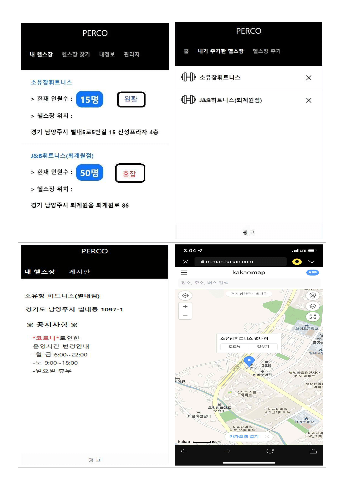
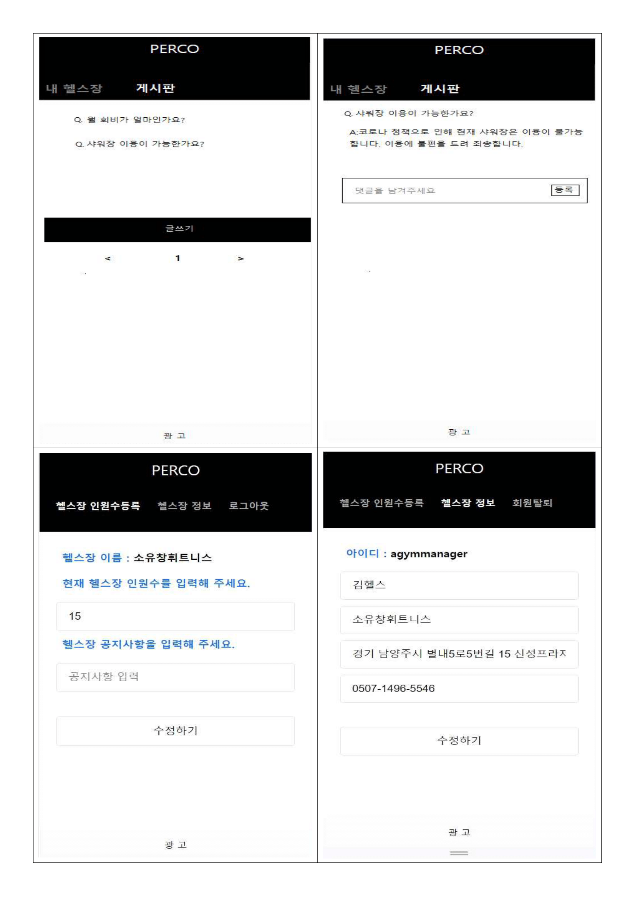

# SW프로젝트 - Perco 헬스장 인원수 제공 서비스

## 팀원: 최인규, 서민석, 허희만

 - 프론트 엔드 / 백 엔드(DB): 최인규, 서민석, 허희만

## 프로젝트 소개

- 코로나 바이러스로 인한 불안감으로 인해 불필요한 인원 접촉을 줄여야겠다는 생각에 시작하게 되었습니다.
- 코로나 발생으로 헬스장(장소) 이용시 헬스장별(장소) 인원수 제한이 생기며, 다수 인구가 밀집되어 있는 곳에 대한 두려움이 생겼습니다.
- 아이디어 회의를 통해 각 헬스장별(장소) 인원수를 가기전 미리 알 수 있다면 불필요한 인원 접촉을 줄일 수 있지 않을까? 라는 아이디어가 나왔습니다.
- 인원수 제공 서비스만이 아닌 헬스장 이용에 관한 추가적인 서비스(헬스장 위치, 상담, 공지사항 확인 등)를 제작할 계획 입니다.

## 기존 앱과의 차별점

- PERCO만의 차별성, 장점을 생각해보고 기존앱과의 차별성을 생각해 PERCO를 보완하였습니다.

|PERCO|기존 앱|
|-|-|
|헬스장별 인원수를 제공합니다.|기존 앱 중 헬스장의 인원을 제공해주는 서비스는 없었습니다.|
|헬스장만이 아닌 인원 수를 제공해야하는 장소 또한 사용 할 수 있게 발전가능합니다.|기존의 인원 수는 홈페이지에서 확인을 했야만 했습니다.|
|헬스장별 커뮤니티를 만들어 공지사항이나, Q&A가 가능한 피드가 만들어져 있습니다.|도서관 좌석정보 앱과 비슷하지만, 커뮤니티가 활성화 되어있지 않았습니다.|
|관리자는 앱을 통해 이용자에게 인원 수, 공지사항 전달, 커뮤니티 활성화등의 편의성을 제공합니다.|기존 앱은 경영자, 관리자들의 편의성을 위해 만들어진 앱이 많았습니다.|

## 작품의 특징 및 장점
- 환자가 스스로 식단관리를 할 때 식단의 전문적인 정보를 확인할 수 있다.
- 식단 기록 : 사용자가 자신의 식단을 기록하면 알맞은 AI피드백을 제공한다.
  >> 사용자는 AI피드백을 통해 식단의 문제점을 파악할 수 있다.
- 식단 영양 분석 : 촬영한 식단에 대한 영양을 분석하여 사용자에게 제공한다.
  >> 영양 분석을 통하여 필요한 영양 정보를 확인할 수 있다.

## 프로젝트 개발환경
|구분|항목|적용내역|
|-|-|-|
|OS|Android, iOS|Android, iOS에서 적용되게 구현|
|개발환경(IDE)|Visual Studio Code, eclips, MySQL|앱의 DB, 기능적, 디자인적 개발을 위한 환경|
|개발도구|Chrome|앱의 구현을 위한 도구, WepApp|
|개발언어|HTML, JS, CSS, JAVA|앱의 기능, 디자인을 구현|

## 각페이지별 UI

## 주요기능 설명
|    화면    |    설명    |
|-|-|
|홈 화면|- 메인페이지에서는 헬스장별 인원 수와 현재 헬스장의 혼잡도를 알 수 있습니다.  - 혼잡도는 인원 수별 혼잡,보통,원활이 나오게 됩니다.  내가 추가한 헬스장이 뜨며, 헬스장 이름, 위치를 알 수 있습니다.  - 내가 다니는 헬스장을 누르면 해당 헬스장의 커뮤니케이션 공간으로 넘어갈 수 있습니다.|
|헬스장 추가|- 헬스장 추가 배너를 들어가면 헬스장관리자가 등록한 헬스장들이 나옵니다.  - 사용자는 원하는 헬스장을 추가하여 내가 추가한 헬스장을 통해 확인할 수 있습니다.(DB 저장)|
|헬스장 피드|- 메인페이지에서 나의 헬스장을 클릭하여 들어가면 헬스장 피드가 나옵니다.  - 헬스장 피드에는 헬스장 이름, 위치, 공지사항이 사용자에게 보여지게 합니다.  - 추가로 헬스장 위치를 클릭하면 카카오지도와 연동되어 위치서비스를 제공합니다.|
|헬스장 위치|- 헬스장 피드에서 헬스장 위치를 클릭 시 카카오맵과 연동되어 헬스장의 실제 위치를 지도로 사용자에게 보여지게 하였습니다.|
|헬스장 게시판|- 게시판페이지에서는 이용자가 글쓰기를 통해 질문을 작성할 수 있습니다.|
|헬스장 게시판-2|- 이용자가 등록한 게시판의 글을 클릭하면 댓글을 등록할 수 있는 페이지가 나옵니다.  - 이용자가 질문 한 궁금한 사항의 답변을 관리자가 답변을 적고 등록버튼을 통해 이용자에게 정보를 제공해줍니다.|
|관리자 화면|- 관리자로 회원가입을 하면 관리자 페이지에 접속할 수 있습니다.  - 헬스장의 현재 인원수를 입력할 수 있으며, 공지사항을 작성할 수 있습니다.  - 인원 수와 공지사항은 이용자에게 제공됩니다.  - 헬스장 정보 배너에 들어가보면 관리자 로그인 시 입력한 헬스장 정보를 확인 할 수 있으며 수정또한 가능합니다.|

## 최종 프로토타입 제작
- [■] 프로젝트 기한에 맞춰 프로토타입 제작 완료
- [■] 프로토타입을 시연하는 성과발표 진행
- [■] 시연 동영상 : https://youtu.be/haroVH1KZ9A

## 기대효과 및 활용분야
- 앱 사용 회원들의 전반적인 식단관리를 바탕으로 마케팅 기회 확보 및 식단관리 플랫폼 운영할 수 있습니다.
- 사용자에게 맞춘 식사 분류 및 피드백 AI 제공하여 식단관리의 어려움을 개선해줍니다.
- 수술이나 시술 후 식단관리를 필수적으로 해야 하는 환자들에게 스스로가 아닌 앱을 통해 식단관리를 하게 해줍니다.
- 식단관리 앱을 병원에서 사용하여 이용하는 타겟층에 대해 전문적인 지식을 보여주어 식단관리 앱의 가치를 높여줍니다.
